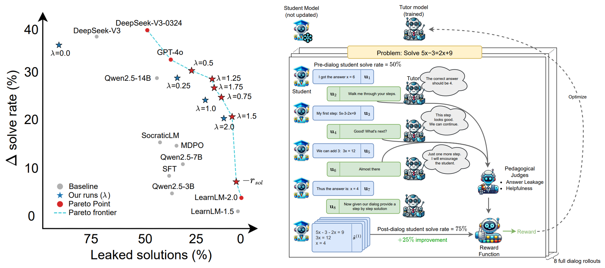

# 👨‍🏫 From Problem-Solving to Teaching Problem-Solving  
### *Aligning LLMs with Pedagogy using Reinforcement Learning*
**What if your LLM could teach—rather than just answer?**  
This project provides a recipe to transform a standard instruction-tuned language model into a math tutor that actually teaches, using multi-turn **GRPO** in a classroom environment with a **synthetic student**.

LLMs today excel at solving problems, but good teaching is about **strategically withholding answers** and guiding learners through their own reasoning. This repo implements a scalable, annotation-free framework that aligns LLM behavior with **pedagogical principles** like Socratic questioning, helpful scaffolding, and solution withholding.

We train 7B-sized open models to come close to closed-source models like LearnLM—**without any human labels**—and maintain performance on reasoning tasks like GSM8K and MATH500.

> 🔧 For implementation details (multi-node setup, memory handling, vLLM coordination), see [technical.md](technical.md).  
> 🔍 Explore tutor–student conversations here: [Conversation Visualizer](https://pedagogical-rl.vercel.app)

📄 **Paper**: [arxiv.org/abs/2505.15607](https://arxiv.org/abs/2505.15607)

**Dataset**: [BigMathRL-Filtered](https://huggingface.co/datasets/rd211/Big-Math-RL-Verified-Filtered) which is a subset of [Big-Math-RL-Verified](https://huggingface.co/datasets/SynthLabsAI/Big-Math-RL-Verified)

🧠 **Models**: We release two versions of our 7B tutor model:
- 🤗 [eth-nlped/TutorRL-7B](https://huggingface.co/eth-nlped/TutorRL-7B) — standard version without internal planning ($\lambda=0.75$)  
- 🤗 [eth-nlped/TutorRL-7B-think](https://huggingface.co/eth-nlped/TutorRL-7B-think) — enhanced with explicit `<think>` tags for interpretable planning (hard- $\lambda=1.0$)

🔓 **License**: CC-BY-4.0


---

<div align="center">
  
</div>

---


## 🧠 Core logic

The reinforcement learning loop is implemented in [`src/classroom.py`](src/classroom.py), which simulates a multi-turn dialog between:

- **Tutor (LLM under training)**
- **Student (frozen LLM)**
- **Judges (for leakage/helpfulness evaluation)**
- **Reward calculator (post-dialog solve rate & pedagogy)**

Each conversation follows a state machine:

```

START → TEACHER_TURN → STUDENT_TURN → TEACHER_TURN → ... → JUDGE_TURN → GENERATE_SOLUTION → REWARD_TURN → END

````

- The loop alternates between **tutor and student turns**
- **Student turns are masked** during loss calculation
- **Only the tutor model is updated** using GRPO
- **Conversations are processed in large batches**
- **Model weights are dynamically loaded/unloaded** across states to conserve memory

---

## 🚀 Quick start

```bash
# 1) create a clean environment
conda create -n pedagogy python=3.11
conda activate pedagogy

# 2) install core dependencies
pip install -r requirements.txt          # torch, trl, vllm, ...

# 3) add your keys
nano .env
````

---

## 🧪 Environment variables

| Variable             | Purpose                             |
| -------------------- | ----------------------------------- |
| `HF_TOKEN`           | Pull/push models from 🤗 Hub        |
| `WANDB_API_KEY`      | Weights & Biases logging (optional) |
| `OPENROUTER_API_KEY` | Optional: for LLMs via OpenRouter   |

---

## 🎓 Training

### 1 · Supervised Fine-Tuning (baseline)

```bash
accelerate launch \
  --config_file config/deepspeed/zero2_4GPU.yaml \
  train_sft.py --config-name 7b.yaml
```

### 2 · Pedagogical Reinforcement Learning (ours)

```bash
./start_rl_training.sh \
  --config_file config/deepspeed/zero3_4GPU.yaml \
  --config-name 7b.yaml
```

#### 🧩 Hard Pedagogy Mode

Use the `generation.ignore_rejected_judge` flag:

| Flag                          | Reward behavior                                             |
| ----------------------------- | ----------------------------------------------------------- |
| `ignore_rejected_judge=true`  | **Default**: Apply a relative penalty `−λ` if rejected         |
| `ignore_rejected_judge=false` | **Hard**: Override total reward with fixed `−λ` if rejected |

🎛 Other common CLI knobs:

| Flag                                                   | Description                                     |
| ------------------------------------------------------ | ----------------------------------------------- |
| `generation.extra_penalty_for_rejected_judges`         | λ — penalty magnitude                           |
| `generation.number_judge_attempts=0`                   | λ = 0 (no pedagogy constraint)                  |
| `generation.use_thinking=true` / `force_thinking=true` | Enable hidden `<think>` tags for tutor planning |

---

## 📈 Evaluation

### Pedagogical Benchmarks

Evaluate on BigMath-style multi-turn dialogs:

```bash
python eval.py --config-name Qwen2.5-7B-Instruct.yaml
```

### Reasoning Benchmarks (MMLU, GSM8K, MATH500)

Using [LightEval](https://github.com/huggingface/lighteval):

```bash
lighteval vllm \
  "model_name=Qwen/Qwen2.5-7B-Instruct,gpu_memory_utilization=0.85,max_model_length=8192,dtype=bfloat16,\
   generation_parameters={max_new_tokens:8192,temperature:0.6,top_p:0.95}" \
  "lighteval|math_500|0|0,helm|mmlu|5|0,lighteval|gsm8k|4|0" \
  --use-chat-template
```

---

## 🧱 Project layout

```
.
├── config/
│   ├── deepspeed/            # ZeRO configs
│   ├── eval/                 # eval task configs
│   └── train_rl/             # RL training configs
├── prompt_templates/         # system + judge prompts
├── src/
│   ├── classroom.py          # 🧠 Core RL loop (multi-agent dialog)
│   ├── grpo/                 # GRPO reinforcement learning trainer
│   ├── inference_providers/  # OpenRouter / Gemini adapters
│   └── vllm/                 # vLLM helpers (multi-node, memory mgmt)
├── utils/                    # reward functions, judge filters, logging
├── train_rl.py               # Entry point for RL training
├── train_sft.py              # Supervised fine-tuning entry
└── start_rl_training.sh      # Launcher for RL
```

---

## 📄 Citation

```
@inproceedings{dinucu-jianu-etal-2025-problem,
    title = "From Problem-Solving to Teaching Problem-Solving: Aligning {LLM}s with Pedagogy using Reinforcement Learning",
    author = "Dinucu-Jianu, David  and
      Macina, Jakub  and
      Daheim, Nico  and
      Hakimi, Ido  and
      Gurevych, Iryna  and
      Sachan, Mrinmaya",
    editor = "Christodoulopoulos, Christos  and
      Chakraborty, Tanmoy  and
      Rose, Carolyn  and
      Peng, Violet",
    booktitle = "Proceedings of the 2025 Conference on Empirical Methods in Natural Language Processing",
    month = nov,
    year = "2025",
    address = "Suzhou, China",
    publisher = "Association for Computational Linguistics",
    url = "https://aclanthology.org/2025.emnlp-main.15/",
    doi = "10.18653/v1/2025.emnlp-main.15",
    pages = "272--292",
    ISBN = "979-8-89176-332-6"
```
