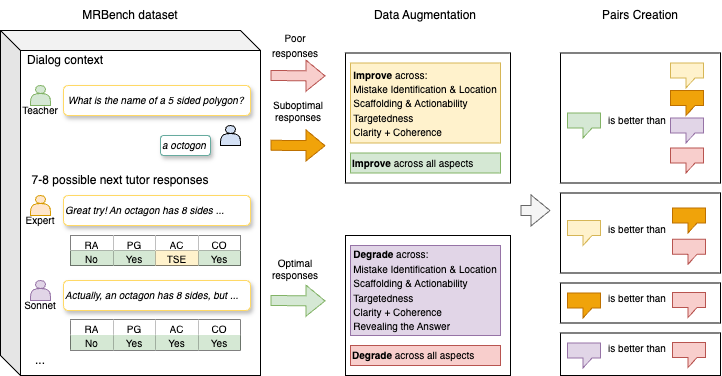

# Towards Reward Modeling for AI Tutors in Math Mistake Remediation

[Kseniia Petukhova](https://scholar.google.com/citations?user=XsiLKJcAAAAJ&hl=en&oi=ao), [Ekaterina Kochmar](https://ekochmar.github.io/about/)


## Overview
This repository serves as the official implementation hub for the paper:

Towards Reward Modeling for AI Tutors in Math Mistake Remediation

Evaluating the pedagogical quality of AI tutors remains challenging: standard NLG metrics do not determine whether responses identify mistakes, scaffold reasoning, or avoid revealing the answers. For the task of mistake remediation, we derive a hierarchy of pedagogical aspects from human pairwise preferences on MRBench, and synthesize minimally contrastive response pairs that differ along key aspects (e.g., mistake identification and location, targetedness, scaffolding, actionability, clarity, and coherence). We develop and release Bradley-Terry preference models trained on weighted-sum rankings that we automatically create from MRBench, synthetic pairs, and data combinations. Using only synthetic data, our best model reaches 0.69 pairwise accuracy on a human preference test, and combining weighted-sum data with targeted synthetic groups improves accuracy to 0.74, outperforming larger general-purpose reward models while using only a 0.5B-parameter backbone.

We release all resources developed in this work, including the annotated human preference data, the synthetic augmentation dataset, the trained reward model, and the code, to support further development of pedagogically-aligned AI tutors.

**Figure: Pipeline for synthetic data augmentation**



*The procedure augments MRBench by generating aspect-specific improvements of suboptimal responses, jointly improved variants, and controlled degradations of optimal responses, thereby constructing structured preference pairs aligned with human annotation preferences. Suboptimal responses are those that do not receive desirable annotations in one or more of the following MRBench dimensions: Revealing the Answer, Providing Guidance, Actionability, and Coherence. In contrast, poor responses receive undesirable annotations across all four of these dimensions.*

---

## 📁 Project Structure

```
Towards_Reward_Modeling_for_Tutors/
├── README.md
├── requirements.txt
├── data_generation_pipeline.png
├── train.py
├── inference.py
├── generate_synthetic_dataset.py
├── prompts/
│   ├── synthetic_generation_prompt.py
│   ├── synthetic_generation_one_aspect_prompt.py
│   ├── synthetic_degradation_prompt.py
│   ├── synthetic_degradation_one_aspect_prompt.py
│   ├── basic_prompt.py
│   ├── prompt_with_guidelines.py
│   ├── prompt_with_checklist.py
│   └── prompt_with_hierarchy_of_aspects.py
├── data/
    ├── human_preference_data/
    │   └── human_preference.csv
    ├── weighted_sum_dataset/
    │   ├── create_mrbench_v2_ranked.py
    │   ├── MRBench_V2_Ranked.json
    │   ├── weighted_sum_train.csv
    │   ├── weighted_sum_dev.csv
    │   └── weighted_sum_test.csv
    └── synthetic_augmentation_dataset/
        ├── synth_train.csv
        ├── synth_dev.csv
        └── aspects_groups/
```


## ⚙️ Installation
```bash
pip install -r requirements.txt
```

## Data Generation

### Required Arguments:
- `--input-json`: path to ranked MRBench JSON (e.g. `data/weighted_sum_dataset/MRBench_V2_Ranked.json`)
- `--output-csv`: path to output synthetic pair CSV

### Optional Arguments:
- `--model` (default: `claude-sonnet-4-20250514`)
- `--temperature` (default: `0.0`)
- `--max-tokens` (default: `1000`)
- `--max-conversations` (default: all)
- `--max-retries` (default: `2`)

Before running, set `ANTHROPIC_API_KEY` in your environment (or in `.env`).

### Example:

```bash
python generate_synthetic_dataset.py \
  --input-json data/weighted_sum_dataset/MRBench_V2_Ranked.json \
  --output-csv data/synthetic_augmentation_dataset/synth_train_generated.csv \
  --max-conversations 5
```

### This will:
- read ranked responses from MRBench JSON
- split responses into:
  - suboptimal responses (to improve)
  - optimal responses (to degrade)
- generate:
  - one improved response across all aspects
  - one improved response per aspect (`MistakeIdentification`, `Scaffolding`, `Targetedness`, `Clarity`)
  - one degraded response across all aspects
  - one degraded response per aspect (`Factuality`, `MistakeIdentification`, `Scaffolding`, `Targetedness`, `RevealingAnswer`, `Clarity`)
- save pairwise data with `response_a`, `response_b`, `label`, `generation_type`, `generation_mode`, and `target_aspect`

---

## Training

### Required Arguments:
- `--train-csv`: path to train CSV
- `--eval-csv`: path to eval CSV
- `--output-dir`: directory for checkpoints and final model

### Optional Arguments:
- `--model-name` (default: `unsloth/Qwen2.5-0.5B-Instruct`)
- `--learning-rate` (default: `1e-5`)
- `--num-train-epochs` (default: `5`)
- `--per-device-train-batch-size` (default: `16`)
- `--per-device-eval-batch-size` (default: `16`)
- `--eval-steps` / `--save-steps` (default: `100`)
- `--logging-steps` (default: `10`)
- `--max-length` (default: `1024`)
- `--dataset-num-proc` (default: `4`)
- `--report-to` (default: `none`; set to `wandb` to log to Weights & Biases)
- `--early-stopping-patience` (default: `10`)
- `--shuffle-train` (flag)

### Example:

```bash
python train.py \
  --train-csv data/weighted_sum_dataset/weighted_sum_train.csv \
  --eval-csv data/weighted_sum_dataset/weighted_sum_dev.csv \
  --output-dir runs/weighted_sum_qwen05 \
  --shuffle-train
```

### This will:
- convert each pair into TRL reward format (`chosen`/`rejected`)
- train a reward model with `trl.RewardTrainer`
- evaluate during training and keep best checkpoint based on `eval_accuracy`
- save the final model and tokenizer to `OUTPUT_DIR/final_model`

---

## Inference

### Required Arguments:
- `--test-csv`: path to test CSV in pairwise format
- `--output-dir`: directory to store inference outputs

Model source options:
- Local model: `--model-path`
- Hugging Face model (default repo: `kpetyxova/towards-reward-modeling-tutors`): `--download-from-hf`
- If `--model-path` is omitted, inference defaults to downloading from Hugging Face.

### Optional Arguments:
- `--model-path` (required for local mode)
- `--download-from-hf` (flag)
- `--hf-repo-id` (optional; default: `kpetyxova/towards-reward-modeling-tutors`)
- `--max-length` (default: `1024`)
- `--predictions-file`, `--metrics-file`

### Output:
- predictions CSV (default: `test_inference_predictions.csv`) with per-example scores and predictions
- metrics JSON (default: `test_inference_metrics.json`) with summary accuracy/stats
- appended run history CSV (default: `metrics_history.csv`)

### Example:
```bash
python inference.py \
  --model-path model \
  --test-csv data/weighted_sum_dataset/weighted_sum_test.csv \
  --output-dir outputs
```

Example (download from Hugging Face first):
```bash
python inference.py \
  --test-csv data/weighted_sum_dataset/weighted_sum_test.csv \
  --output-dir outputs
```